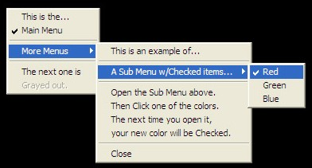



## Cre8Popup

### Description

A brief and simple PopUp Menu Tutorial. 

Apr 22, 2007 - Added a 'Check-Box' Sub_Menu.

Improved Menu names for easier reading and added more documentation.
 
### More Info
 

             |
---                |---
**Submitted On**   |2007-05-31 11:37:40
**By**             |[Randy Giese](https://github.com/Planet-Source-Code/PSCIndex/blob/master/ByAuthor/randy-giese.md)
**Level**          |Intermediate
**User Rating**    |5.0 (90 globes from 18 users)
**Compatibility**  |VB 6\.0
**Category**       |[Windows API Call/ Explanation](https://github.com/Planet-Source-Code/PSCIndex/blob/master/ByCategory/windows-api-call-explanation__1-39.md)
**World**          |[Visual Basic](https://github.com/Planet-Source-Code/PSCIndex/blob/master/ByWorld/visual-basic.md)
**Archive File**   |[Cre8Popup2068365312007\.Zip](https://github.com/Planet-Source-Code/randy-giese-cre8popup__1-68311/archive/master.zip)

### Source Code

Run the HTML file. The brief Tutorial will take you step by step through the process of creating Popup Menus. I hope you find it helpful... 
May 31, 2007 - Added a real HTML Tutorial page so you can follow along line by line. 
Major improvement to the Check-Boxes. 
Randy Giese

